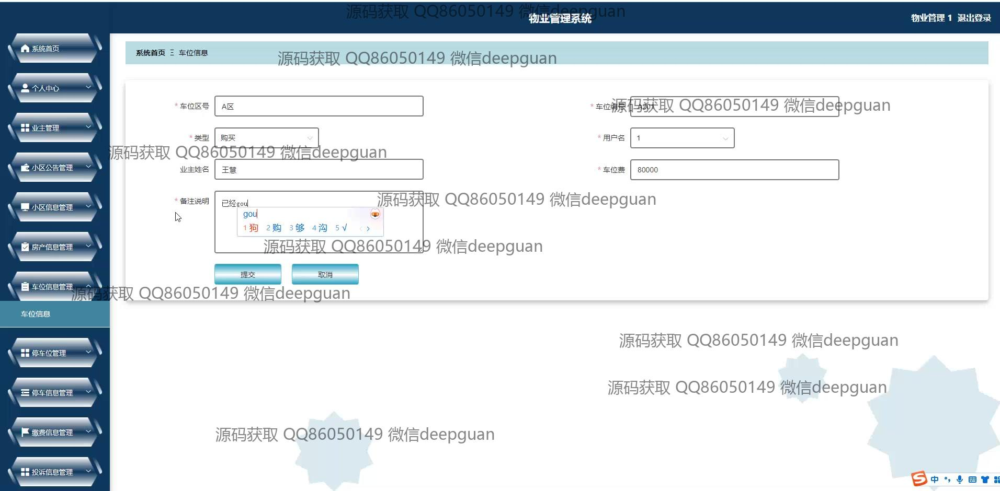
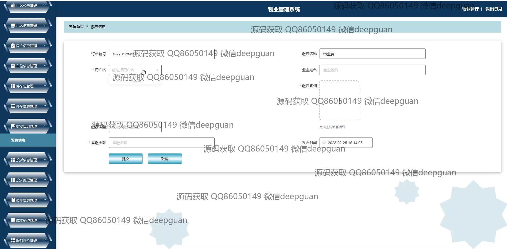
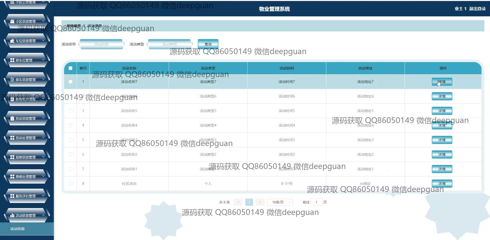

<h1 align="center">物业管理系统演示</h1>

## 简介
物业管理系统：功能分为用户和管理员角色，主要包括业主管理、物业费缴纳、维修处理、公告发布、车位管理和投诉信息等模块，提升管理效率和用户体验。    --计算机毕业设计源码；毕设源码；java毕业设计源码

## 联系方式

<h3 align="center">获取完整代码与数据库文件 + 微信：deepguan QQ: 86050149 QQ群: 783742310</h3>

<h3 align="center">可帮忙远程部署 包运行成功！提供远程部署、修改代码、设计文档指导、代码讲解等服务！</h3>

## 功能介绍（完整见运行截图）
管理员：管理员可以通过该物业管理系统实现登录、注册和退出功能。系统首页配有导航栏，提供模块便捷访问。管理模块包括业主管理、维修员管理、小区公告及信息管理、房产及车位信息管理等，管理员可以在各模块中执行增删改查操作，负责发布和管理小区公告及处理住户的报修请求。管理员还可使用系统查看停车位、报修信息及住户缴费信息，并进行处理和评价。

住户：住户通过系统可以进行注册、登录和登出操作。在个人中心模块，住户能够管理个人信息、查看和修改住户档案。住户可以提交报修申请和管理自己报修信息，也可以查看费用清单并在线支付房产和物业费用。在小区公告模块，住户可以查看发布的公告内容，了解小区的最新动态和通知。住户还能够通过投诉信息功能向物业进行投诉，并查看处理进展。

## 运行截图

本代码来源于网络,仅供学习参考使用!

